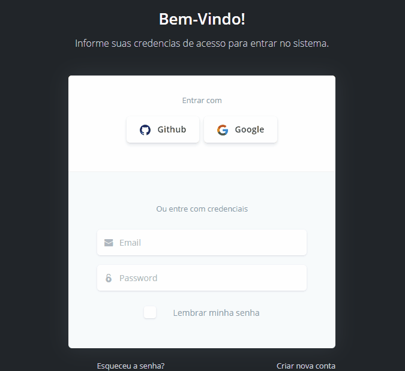
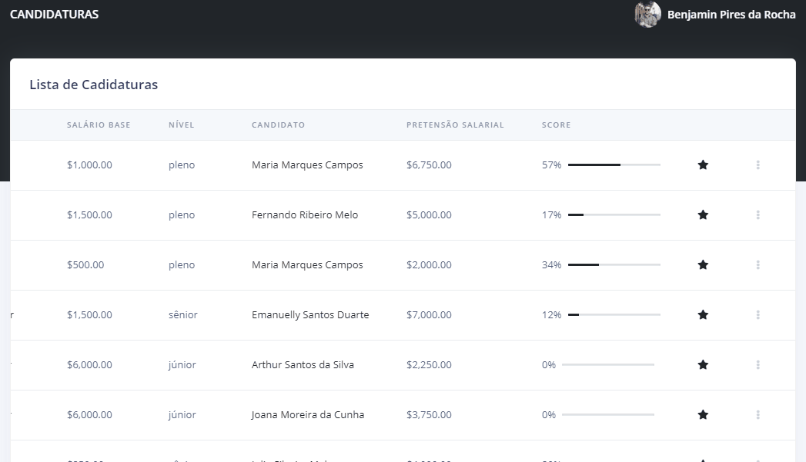

<h1 align="center">
   Skill - Buscando Habilidades
</h1>

 

## :camera: Demonstração

  
  

## :rocket: Tecnologias

Esse projeto foi desenvolvido com as seguintes tecnologias:

✔️Angular

✔️Angular CLI

✔️Node js

✔️Bootstrap

✔️C#

✔️SQLite

## 💻 Projeto

Skill é um sistema web que permite aos usuários buscar vagas de emprego gratuitamente ou ofertar vagas de emprego comparando o perfil
do candidato como da vaga ofertada e realizando o agendamento de entrevistas pelo próprio sistema e enviando um feedback para o candidato após entrevista.

https://github.com/camilaleal/Skill/blob/master/artefatos/CANVAS_MVP.png

---
